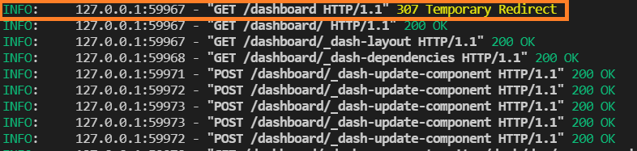
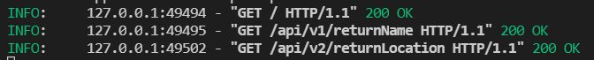
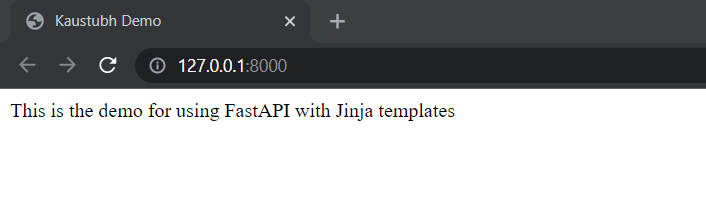
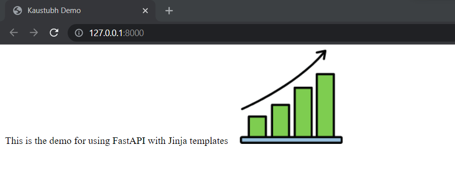

# Five Advanced Features of FastAPI
FastAPI offers all the standard features of an API building tool but it is not limited to this. It comes with a lot of flexibility such as backward WSGI mounting support which, most of the users, are not aware of.

# 1: Include Flask, Django, Dash, or any other WSGI
FastAPI is an ASGI web framework. What this means is that different requests don’t have to wait for the others before them to finish doing their tasks. Different requests can do their task completion in no particular order. On the other hand, the WSGI frameworks process request in a sequential manner.

FastAPI allows any type of WSGI application like Flask to be mounted inside a FastAPI application. What this means is that on the root level, you can have the main FastAPI app and further, for different routes, you can have WSGI applications such as Flask which will handle all requests for that specific path.

One of the use cases of this, which I have been using for my project is mounting plotly-dash as WSGI middleware. I had mounted the dash server for the dashboard route of my website which segregates the dashboard logic from the main FastAPI application. This also provides the flexibility to disable the dashboard anytime the server load is more. Here is an abstract implementation of WSGI middleware mounting which I did for one of the projects.

Below are the example contents for the dashboard.py file:
```python
from dash import html
from dash import dcc
import dash_bootstrap_components as dbc
import dash


dash_app = dash.Dash(__name__,
                     requests_pathname_prefix='/dashboard/', title='Kaustubh Demo')

header = dbc.Row(
    dbc.Col(
        [
            html.Div(style={"height": 30}),
            html.H1("Demo", className="text-center"),
        ]
    ),
    className="mb-4",
)

dash_app.layout = dbc.Container(
    [
        header,
    ],
    fluid=True,
    className="bg-light",
)
```

To include this dash server as an independent application within FastAPI, simply wrap the WSGI application object in the WSGIMiddleware class and pass this wrapped object as a parameter in the mount function of the root FastAPI object. The mount function also takes in the path on which this application should be used. For instance, this dashboard would be mounted on the “/dashboard” path. See the contents of the main.py file below:
```python
from fastapi import FastAPI
from fastapi.middleware.wsgi import WSGIMiddleware
from demo_dash import dash_app
import uvicorn

app = FastAPI()
app.mount("/dashboard", WSGIMiddleware(dash_app.server))

@app.get('/')
def index():
    return "Hello"

if __name__ == "__main__":
    uvicorn.run("main:app", host='127.0.0.1', port=8000, reload=True)
```

If anyone visits the dashboard route, all those requests would be temporarily redirected to the dash server.


# 2: Mount different FastAPI apps for different routes
Following the same rules of mounting different WSGI applications for different routes, you can also mount different FastAPI applications within the FastAPI application. This would mean that every sub-FastAPI application would have its docs, would run independent of other applications, and will handle its path-specific requests. To mount this, simply create a master application and sub-application file. Now, import the app object from the sub-application file to the master application file and pass this object directly to the mount function of the master application object. This workaround doesn’t require any middleware. See an example below:

Below are the contents for the `apiv1.py` file (sub-application 1):
```python
from fastapi import FastAPI


apiv1 = FastAPI()

@apiv1.get('/returnName')
def index():
    return {"Name": "Kaustubh demo"}
```

And here is the code for the apiv2.py file (sub-application 2):
```python
from fastapi import FastAPI


apiv2 = FastAPI()

@apiv2.get('/returnLocation')
def index():
    return {"Location": "India"}
```

Now, we can mount both of these sub-applications in the master application. See the code for the `master.py` file:
```python
from fastapi import FastAPI
from apiv1 import apiv1
from apiv2 import apiv2
import uvicorn

app = FastAPI()
app.mount("/api/v1", apiv1)
app.mount("/api/v2", apiv2)


@app.get('/')
def index():
    return "Hello"

if __name__ == "__main__":
    uvicorn.run("master:app", host='127.0.0.1', port=8000, reload=True)
```

If you make requests to respective paths endpoints, the request will be handled by those sub-applications.


# 3: Separate your FastAPI Routes into different files
It usually happens that as your application grows bigger, it becomes a mess to manage all the routes in one place. Sometimes, overlaps can happen or you might be duplicating a route unaware of the consequences later. What if there was a system where you could group your routes into different file structures and easily manage them?

FastAPI has a system of `APIRouters`. These can be considered to be mini FastAPI apps that are part of the bigger application. This means that one can break bigger application routes into small units of APIRouters and mount individual APIRouters in the main application.

Do note here that these APIRouters are part of the bigger application and not the independent applications like the ones we saw in the above two sections. Therefore, all the routes from all the APIRouters will be listed in the main application documentation.

These APIRouters can have separate prefixes to the path operations, tags, dependencies, & responses. Therefore to implement this, you need to import the APIRouter class from fast API and then use its object to create routes as you would do in a usual FastAPI application.

Let’s see an example. Suppose we are building a library management system and we want to handle books and novel data separately. Let this be the code for the `book.py` file:
```python
from fastapi import APIRouter

bookroute = APIRouter()

@bookroute.get('/info')
def books():
    return {"detail": "This book info is from the book APIRouter",
    "name": "Hello",
    "ISBN": "32DS3"}
```

And this is the code for the `novel.py` file:
```python
from fastapi import APIRouter

novelroute = APIRouter()

@novelroute.get('/info')
def novels():
    return {"detail": "This novel info is from the novel APIRouter",
    "name": "I am good",
    "publication": "Kaustubh"}
```

Now, to include both the routers in the main application, simply import the object of APIRouter and pass these in the include_router function of the main FastAPI application object. We will also add the prefixes for these routers so that the same endpoints in both routers don’t conflict. See the implementation below:
```python
from fastapi import FastAPI
from book import bookroute
from novel import novelroute
import uvicorn

app = FastAPI()
app.include_router(bookroute, prefix="/book")
app.include_router(novelroute, prefix="/novel")


@app.get('/')
def index():
    return "Hello"

if __name__ == "__main__":
    uvicorn.run("demo:app", host='127.0.0.1', port=8000, reload=True)
```

If you hit the `/book/info` and the `/novel/info` endpoints, you will get different responses depending upon how you handled those inputs in the APIRouters.
")
")

In this way, you can have multiple APIRouters to handle parameters based on what type of operation you want to perform for those groups of endpoints.

# 4: Add static files and Jinja templates
FastAPI is not limited to serving as a framework for creating APIs. You can serve static files such as HTML, CSS, JS and incorporate Jinja templating engine, as you would do in Flask. This means that you can host a complete website with FastAPI.

Let me correlate this to Flask. In the Flask framework, you need to have a folder with the name `templates`, where you can have all the HTML files with Jinja templating (let me know in the comments if you would like me to create a detailed article on Jinja templating engine) and in the main application, one can directly use the render_template function from flask to return these templates with the data to be filled in these templates.

In FastAPI, on the abstract level, the process remains the same but with few changes. Step by step process:
- First, you need to create an object for Jinja templates where you need to specify the path of the templates folder. In FastAPI, there is no constraint on the folder name, you can name it anything. You only need to provide the folder path here. Technically, you need to import the `Jinja2Templates` class from the fast API templating module and create an object for that class with the folder path.
- Next, you need to provide the `response_class` in the FastAPI route method (eg: GET, POST) as `HTMLResponse` class. This class can be imported from the fast API responses module. Also, you need to create a request parameter of the `Request` class type in the decorator function. This class can be imported from the `FastAPI` module.
- To render and provide data to these templates on hitting the respective endpoints, you need to return the Jinja2Templates class object `TemplateResponse` function. This function takes in the HTML template name and the context dictionary. The context dictionary must have the `request` key with value as the request parameter you created in the decorator function. The data to be sent to the Jinja templates can be added in this context dictionary as key-value pair.
Here is the code implementation of the above steps:
```python
from fastapi import FastAPI, Request
from fastapi.templating import Jinja2Templates
from fastapi.responses import HTMLResponse
import uvicorn

app = FastAPI()
templates = Jinja2Templates(directory="demo")


@app.get('/', response_class=HTMLResponse)
def index(request: Request):
    return templates.TemplateResponse("demo.html", {"request": request, "title": "Kaustubh Demo", "body_content": "This is the demo for using FastAPI with Jinja templates"})

if __name__ == "__main__":
    uvicorn.run("demo2:app", host='127.0.0.1', port=8000, reload=True)
```

Now, in the HTML templates, you can fill in the variables, as per the syntax of the Jinja engine, with the name used as the keys in the context dictionary.
```html
<!doctype html>
<html lang="en">

<head>
    <title>{{title}}</title>
</head>

<body>
{{body_content}}
</body>

</html>
```

Start the FastAPI application and you will have this output:


To include all the images, JS, and CSS files in HTML, in Flask, you would use the `url_for` and provide the folder name as `static` followed by the filename parameter. In FastAPI, the process is easier. Simply:
- Create an object for `StaticFiles` class from the FastAPI `staticfiles` module and provide the folder path to the static file. Again, no constraint on the folder name.
- Mount this static files object to one of the paths, preferably `static` to avoid confusion and provide this mount a name to be used internally by FastAPI.
I have added the logic for the static files in the same code used for Jinja files serving:
```python
from fastapi import FastAPI, Request
from fastapi.templating import Jinja2Templates
from fastapi.staticfiles import StaticFiles
from fastapi.responses import HTMLResponse
import uvicorn

app = FastAPI()
staticfiles = StaticFiles(directory="demo/toServe")
app.mount("/static", staticfiles, name="static")
templates = Jinja2Templates(directory="demo")


@app.get('/', response_class=HTMLResponse)
def index(request: Request):
    return templates.TemplateResponse("demo.html", {"request": request, "title": "Kaustubh Demo", "body_content": "This is the demo for using FastAPI with Jinja templates"})

if __name__ == "__main__":
    uvicorn.run("demo3:app", host='127.0.0.1', port=8000, reload=True)
```

Now, suppose you have an image `img1.png`, which you want to include in your HTML file. Simply, in the `src` attribute of the `img` tag, use the path as: `/<path_on_which_static_files_are_mounted>/<image_directory>/<image_name>`. (Here image directory depends on your file structure)

Here is the updated code for the above used Jinja template HTML file with the image tag :
```html
<!doctype html>
<html lang="en">

<head>
    <title>{{title}}</title>
</head>

<body>
{{body_content}}

</body>

</html>
```

And we will have the output for this as:


In this way, you can add up all the files and create a full-fledged website backed by FastAPI.

# 5: Simulate Configuration Handling of Flask in FastAPI App
If you are someone who has been using the Flask web framework for quite some time, you must be aware of app configurations. You can define some of the parameters for your application to be accessed by any part of the application. These usually comprise environment variables. The config attribute, a subclass of the dictionary data structure, resides in the Flask class object. It is where all the configurations are stored. This is especially useful when you are want to hardcode some parts of the application and make calls for these anywhere in the application.

This is what you would do in Flask to define such configuration parameters:
```python
from flask import Flask

app = Flask(__name__)
app.config['appName'] = 'Kaustubh Demo'

@app.route('/')
def index():
    return "Hello: {}".format(app.config['appName'])


if __name__ == "__main__":
    app.run(debug=True)
```

FastAPI doesn’t have this support. Though some of you might think that the application state can be used in this case, but as per Tiangolo (the creator of FastAPI) suggestion, the APIRouter won’t have access to this state. Due to this, even if you save some configuration in the application state, this won’t be shared among all the parts of the application and ultimately won't serve any purpose.

Therefore, a simple workaround for this, suggested by Tiangolo, is to use the Pydantic BaseSettings class and create a model for these settings. This class offers validation features and type annotations. These features set them apart from the usual environment variables where they can only handle string-type values.

To put this together in your FastAPI application, simply import the BaseSettings class from Pydantic and create the subclass for your settings/configurations. These are Pydantic classes and therefore, you can add default values, Field(), and much more. Let me present you with an example to implement this.

Below are the contents for the `config.py` file:
```python
from pydantic import BaseSettings


class Settings(BaseSettings):

    appName: str = "Kaustubh Demo"

    openapi_url: str = ''
```

Here, I have defined `openapi_url` as an empty string. It will disable the docs generation for the FastAPI application. In the main application file, create an object for the configuration model and access the parameters as you would do in a dictionary type data structure:
```python
from fastapi import FastAPI
from config import Settings
import uvicorn

setting = Settings()
app = FastAPI(openapi_url=setting.openapi_url)

@app.get('/')
def index():
    return "Hello: {}".format(setting.appName)

if __name__ == "__main__":
    uvicorn.run("fastapi_config:app", host='127.0.0.1', port=8000, reload=True)
```

This is how you can use this model as a global configuration across your application. It also eliminates the dependency of FastAPI to configure other parts of the application.


